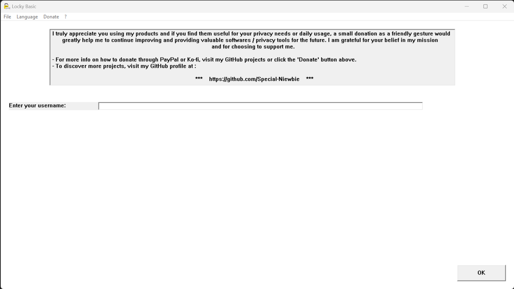

# Locky Basic - Password Generator

Locky Basic is a lightweight and portable password generator program written in C++. It allows users to generate random passwords without the need for installation. The program is designed to work seamlessly from Windows Vista and newer versions of Windows.

## Donation

PayPal:
 

------------------------------------------------------------------------------

Ko-fi:
 

## Features

- User-friendly interface with support for 8 languages: English, Italian, Spanish, Japanese, Chinese, Arabic, Russian, and Hindi.
- First page: Enter your desired username.
 

- Second page: Customize the generation of a random password, including options for lowercase letters, uppercase letters, numbers, and symbols. Set the password length between 4 and 120 characters.
 

- Third page: View the generated username and password. Choose to save the data to a file using the dedicated button or discard it.
 

## Usage
1. Download the Locky Basic program or compile it using your preferred C++ IDE or compiler. Include the necessary headers for compilation.
2. Run Locky Basic on any Windows Vista or newer system.
3. Follow the on-screen instructions to enter your username and customize the password generation.
4. Save or discard the generated password based on your preference.

## For Developers
Locky Basic is developed entirely in C++ without any specific UI Design Framework, allowing you to use any IDE or compiler of your choice. To compile the program, include the necessary headers and dependencies. In this project, Visual Studio 2022 was used for development.

## Contributions

Contributions are welcome! If you have any suggestions, bug reports, or feature requests, please feel free to open an issue or submit a pull request on the [GitHub repository](https://github.com/Special-Niewbie/Locky-Basic/issues).

## License

This program is open-source and released under the [GNU General Public License](LICENSE).
